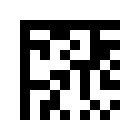
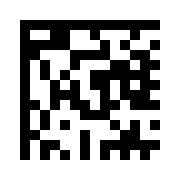
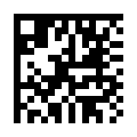

# dmgen & dmdecode — Data Matrix Barcode Tools

A fast, dependency-light C++ CLI toolset for **generating** (`dmgen`) and **decoding** (`dmdecode`) Data Matrix barcodes. Designed for rapid label generation and highly robust factory-floor scanning in manufacturing, logistics, and asset-tracking workflows.

---

## Architecture

### Library: libdmtx

The encoder and decoder are both built on [**libdmtx**](https://github.com/dmtx/libdmtx) (v0.7.8), the canonical open-source C implementation of the Data Matrix standard. It handles:

- Reed-Solomon ECC200 error correction
- Symbol layout (finder pattern, clock tracks, data region)
- All 30 standardised symbol sizes (square and rectangular)
- Multiple encoding schemes (ASCII, C40, Text, X12, EDIFACT, Base256)

For encoding, we use libdmtx purely to map the data to a matrix — it writes the bits to an internal `DmtxImage` buffer which we then sample manually to produce our SVG/PNG output. For decoding, we feed it severely pre-processed pixels to run the Reed-Solomon backwards.

### OpenCV (Decoder Preprocessing)

To ensure that `dmdecode` can reliably scan noisy, poorly lit factory-level photographs—or perfectly sharp, noise-free synthetic barcodes—we wrap libdmtx in a robust **OpenCV 4** pipeline. OpenCV handles:
- Upsampling small/tightly cropped symbols.
- **CLAHE** (Contrast-Limited Adaptive Histogram Equalization) for normalising uneven warehouse lighting.
- **Adaptive Thresholding** to convert noisy shadows into strict B/W.
- Simulated Gaussian noise for synthetic SVGs/PNGs (because libdmtx's clocking algorithm struggles to find centers on mathematically perfect, sharp squares).

### PNG output: stb_image_write

Rather than pulling in libpng for the encoder, PNG output uses [**stb_image_write**](https://github.com/nothings/stb) — a single-header public-domain library vendored directly.

### JSON parser: hand-rolled, zero deps

The JSON batch parser (`parseJSON()` in `dmgen.cpp`) is a small bespoke implementation (~80 lines). It handles:
- Arrays of plain strings: `["ITEM-001", "ITEM-002"]`
- Arrays of objects with `"data"` and optional `"filename"` keys
- Mixed arrays (strings and objects together)
- JSON string escaping (`\"`, `\\`, `\n`, `\t`, etc.)

No `nlohmann/json` or similar was used — the schema is simple enough that a minimal parser keeps the build truly dependency-free.

---

## How Encoding Works

```
Input string
     │
     ▼
dmtxEncodeCreate()          ← allocate encode context
dmtxEncodeSetProp(...)      ← module size, margin, symbol size
dmtxEncodeDataMatrix(n, s)  ← encode payload → DmtxImage pixel buffer
     │
     ▼
Read pixel buffer (bottom-up, grayscale)
Threshold each module centre pixel (< 128 → dark)
     │
     ▼
Grid{ rows, cols, cells[] }  ← module-level boolean grid
     │
     ├──▶ writeSVG()   → <rect> per dark module, pure SVG
     └──▶ writePNG()   → upscaled grayscale raster via stb_image_write
```

**Why read pixel-by-pixel instead of querying the matrix directly?**
libdmtx's public API does not expose the raw codeword/module matrix — it only provides the rendered pixel image. We sample the centre of each module cell (accounting for the bottom-up row order libdmtx uses internally) to reconstruct the boolean module grid cleanly.

**Why SVG as the default output?**
SVG is vector — it scales to any printer DPI without aliasing. A 10×10 module SVG printed at 600 DPI looks identical to one printed at 2400 DPI. For PNG, the module size (`-m`) directly sets the pixel count per module, so you must size it appropriately for your target DPI.

---

## How Decoding Works

```
Input Image (via cv::imread)
     │
     ▼
Upsample / Soften (GaussianBlur)  ← libdmtx requires "blurry" camera-like gradients
     │
     ▼
Generate Preprocessing Variants   ← "raw", "Otsu", "CLAHE + Adaptive block=21/31/51"
     │
     ▼
(Try 1) Full Image Scan 
     │
     ▼
(Try 2) Contour detection (ROI)   ← Find square-ish shapes in the thresholded pass
     │
     ▼
warpPerspective                   ← Correct rotation, tilt, perspective
     │
     ▼
dmtxImageCreate (DmtxPack8bppK)
dmtxImageSetProp(DmtxFlipY)       ← CRUCIAL: match OpenCV top-down to libdmtx bottom-up!
dmtxDecodeMatrixRegion()          ← libdmtx Reed-Solomon decode
```

**Why the strong preprocessing?**
Factory labels are rarely clean. They suffer from glare, shadow drops, and heavy perspective warp. Our pipeline searches for square-ish regions, isolates the shape, perspective-wraps it into a perfect upright thumbnail, thresholds it cleanly with CLAHE, and *then* hands it to `libdmtx`.

**The Memory Polarity "Gotcha"**
`libdmtx` models images entirely bottom-up (meaning `row=0` in memory is visually the bottom of the image). OpenCV models images top-down. If you pass an OpenCV `cv::Mat` buffer directly to `libdmtx`, the Data Matrix is parsed vertically mirrored. This reverses the L-shaped finder pattern and totally corrupts the bit clocking. We explicitly apply `DmtxPropImageFlip, DmtxFlipY` to synchronize the parsers before issuing the decode command.

---

## Project Layout

```
data-matrices-qr/
├── src/
│   ├── dmgen.cpp           # Main generator (~480 lines, C++17)
│   ├── dmdecode.cpp        # The OpenCV OpenCV/libdmtx pipeline decoder
│   └── stb_image_write.h   # Vendored header-only PNG writer
├── examples/
│   ├── labels.json         # JSON batch input example
│   └── labels.csv          # CSV batch input example
├── out/                    # Default batch output directory
├── Makefile
└── README.md
```

---

## Build

### Requirements
- libdmtx: `brew install libdmtx`
- opencv: `brew install opencv pkg-config`

### Compile

```bash
make          # → builds ./dmgen and ./dmdecode
make test     # → strictly runs an encode → decode round-trip smoke test into test_out/
make clean    # → remove binary and test_out/
```

The Makefile uses `pkg-config` for OpenCV, and links `libdmtx` manually:

```makefile
CV_FLAGS = $(shell pkg-config --cflags opencv4)
CV_LIBS  = $(shell pkg-config --libs opencv4)
```

---

## Usage

### Single label

```bash
# SVG (default, recommended for printing)
./dmgen -d "pallet 234" -o out/pallet_234.svg

# PNG, 15px per module
./dmgen -d "pallet 234" -o out/pallet_234.png -m 15

# PNG, scale automatically so output image never exceeds 120x120 pixels
./dmgen -d "SM3" -o out/sm3.png --max-dim 120

# Force a fixed 24×24 symbol size
./dmgen -d "pallet 234" -o out/pallet_234.svg -s 24x24
```

### Batch — JSON

```bash
./dmgen --json examples/labels.json --out-dir out/
./dmgen --json examples/labels.json --out-dir out/ --fmt png -m 12
```

**JSON format** — array of objects or plain strings (or mixed):

```json
[
  { "data": "pallet 234", "filename": "pallet_234" },
  { "data": "SM3",        "filename": "sm3" },
  { "data": "rack 17",   "filename": "rack_17" }
]
```

- `"data"` — the payload to encode (required)
- `"filename"` — output filename stem, no extension (optional; derived from data if omitted)

### Batch — CSV

```bash
./dmgen --csv examples/labels.csv --out-dir out/ --fmt svg
```

**CSV format** — `data,filename` (filename column optional, `#` lines are comments):

```
# Data: payload,filename
pallet 234,pallet_234
SM3,sm3
rack 17,rack_17
```

### Decoder

```bash
# Decode a single image (PNG or JPG)
./dmdecode test_out/pallet_234.png
./dmdecode cam-scans/photo.jpg

# Decode a batch directory (automatically scans for png, jpg, jpeg)
./dmdecode --dir test_out/

# Force scanning of only specific extensions in a batch directory
./dmdecode --dir test_out/ --ext png

# Debug mode: Output a heavily annotated, highlighted image
./dmdecode test_out/noise.jpg --debug result.jpg

# See exactly which OpenCV step succeeded at isolating the label
./dmdecode test_out/noise.jpg --verbose
```

#### Performance Tracking

On an M-series Apple processor, a standard single-pass decode completes in a fraction of a second. Testing our round-trip code generation on a 16x16 encoded matrix:
```
$ time ./dmdecode test_out/pallet_234.png
test_out/pallet_234.png: pallet 234

real    0m0.217s
user    0m0.19s
sys     0m0.04s
```
That's **~200ms** total round-trip from OpenCV raw-load all the way through downscaling, blurring, matrix detection, and payload execution.

When batch-processing a folder of 3 generated matrices simultaneously:
```bash
$ time ./dmdecode --dir out --ext png
out/pallet_234.png: pallet 234
out/sm3.png: SM3
out/rack_17.png: rack 17

Decoded: 3/3
./dmdecode --dir out --ext png  0.21s user 0.04s system 98% cpu 0.254 total
```
The overhead is minimal, with 3 images processing in just **~250ms**.
### All Options (`dmgen`)

| Flag | Default | Description |
|---|---|---|
| `-d <data>` | — | Payload to encode (single mode) |
| `-o <file>` | `<data>.svg` | Output path (`.svg` or `.png`) |
| `--json <file>` | — | JSON batch input |
| `--csv  <file>` | — | CSV batch input |
| `--out-dir <dir>` | `out` | Output directory for batch mode |
| `--fmt svg\|png` | `svg` | Batch output format |
| `-m <px>` | `5` | Module (cell) size in pixels (1–100) |
| `--max-dim <px>`| — | Maximum image dimension (auto-scales module size) |
| `-s <NxN>` | `auto` | Symbol size — see `--sizes` |
| `--sizes` | — | List all valid symbol sizes and exit |
| `-h`, `--help` | — | Show help |

### Symbol sizes (`-s`)

`auto` selects the smallest square symbol that fits the payload (recommended). Fixed sizes:

```
Square:      10x10  12x12  14x14  16x16  18x18  20x20  22x22  24x24  26x26
             32x32  36x36  40x40  44x44  48x48  52x52  64x64  72x72  80x80
             88x88  96x96  104x104  120x120  132x132  144x144

Rectangular: 8x18  8x32  12x26  12x36  16x36  16x48
```

---

## Output sizing guide

| Use case | Recommended flags |
|---|---|
| Laser marking (small part) | `-m 1 -s 10x10` then scale SVG in your engraver software |
| Thermal label printer (203 DPI) | `-m 4` (PNG) or SVG |
| Thermal label printer (300 DPI) | `-m 6` (PNG) or SVG |
| Desktop inkjet / laser | `-m 10` SVG (let printer handle DPI) |
| Large warehouse shelf label | `-m 20` or larger, SVG |

---

## Example outputs

The three default labels (`pallet 234`, `SM3`, `rack 17`) auto-select these symbol sizes based on their payload characters. 

Here are the generated 10px-module PNGs alongside their `dmdecode` results:

| Image | Label | Symbol Size | Decode Command Output |
|:---:|---|---|---|
|  | `SM3` | 10×10 | `$ ./dmdecode test_out/sm3.png`<br>`test_out/sm3.png: SM3` |
|  | `rack 17` | 14×14 | `$ ./dmdecode test_out/rack_17.png`<br>`test_out/rack_17.png: rack 17` |
|  | `pallet 234` | 16×16 | `$ ./dmdecode test_out/pallet_234.png`<br>`test_out/pallet_234.png: pallet 234` |
